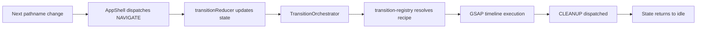
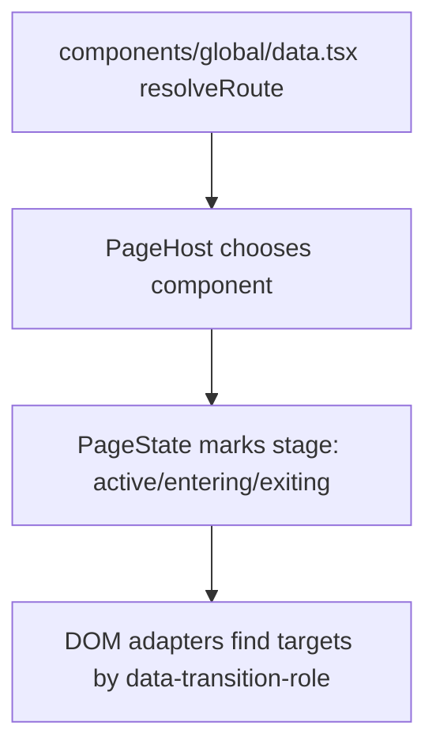
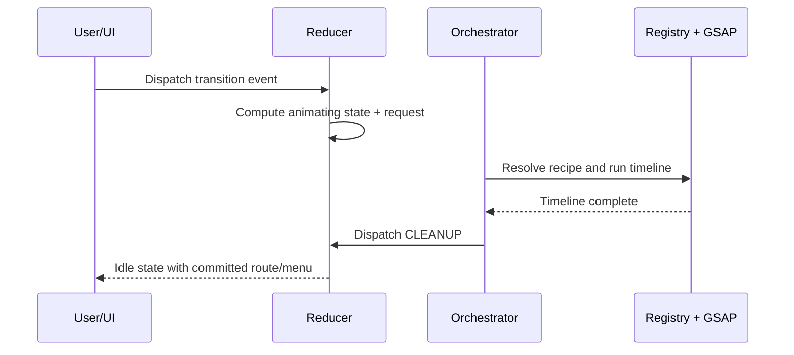

# Sandbox Portfolio Site

## Overview
This project is a portfolio-style website built with Next.js and a custom transition engine for cinematic route changes. Instead of relying on default page swaps, it stages outgoing and incoming pages and runs coordinated GSAP timelines for navigation, menu interactions, and loader dismissal.

The main purpose is to deliver a polished, route-aware browsing experience across pages like Home, Projects, Project Detail, Exhibitions, About, and Contact. The target audience is visitors browsing visual work, where transition quality and continuity matter.

### Highlights

- Custom page transition engine
- Route-aware animations
- Shared element transitions for project list/detail navigation
- Responsive behavior with mobile gating
- Optimized loading experience with intro loader handoff
- Accessibility-conscious semantic page structure

---

## Tech Stack

### Frontend

- Next.js 16
- React 19
- TypeScript
- Tailwind CSS 4 (via PostCSS)
- GSAP + @gsap/react

### Tooling

- ESLint 9 (next/core setup)
- Prettier (not currently configured in this repository)
- GitHub Actions (not currently configured in this repository)

---

## Getting Started

### Prerequisites

- Node.js 20+
- npm 10+

### Installation

```bash
npm install
```

### Environment Variables

No required environment variables are currently defined.

If you add environment-dependent features later, document them in this section and use .env.local for local development.

### Development

```bash
npm run dev
```

Open http://localhost:3000.

### Production Build

```bash
npm run build
npm run start
```

---

## Project Structure
High-level directory overview:

```text
app/
	globals.css
	layout.tsx
	(pages)/
		layout.tsx
		[[...slug]]/
			page.tsx

components/
	global/
	home/
	projects/
	exhibitions/
	about/
	contact/
	navbar/
	pages/
	shell/
	not-found/

transition/
	adapters/
	engine/
	primitives/
	registry/

hooks/
utils/
public/
```

Directory responsibilities:

- app: App Router shell, global layout, and catch-all route entry.
- components: UI modules and route-level page components.
- components/global: Central route definitions and route resolution helpers.
- components/pages: Stage wrappers and host for active/pending route rendering.
- components/shell: App composition (loader, nav, mobile gate, orchestrator host).
- transition/engine: Transition state, events, reducer, selectors, and orchestrator.
- transition/registry: Transition recipe registration and route-specific strategies.
- transition/primitives: Reusable GSAP timeline building blocks.
- transition/adapters: DOM target resolution and GSAP runtime adapter.
- hooks: Shared React hooks (for example, media query handling).
- utils: Generic helper utilities.
- public: Static assets (fonts, images).

---

## Architecture Overview
At a systems level, the app separates route/state decisions from animation execution.

Explainers:

- Routing flow: Next.js pathname changes are observed in AppShell, then converted into NAVIGATE events.
- State flow: Transition reducer is the source of truth and gates transitions with phase (idle or animating).
- Data flow: Route matching is resolved by components/global/data.tsx, then PageHost renders matched content.
- Animation flow: Orchestrator reads reducer requests, resolves recipes from registry, builds timelines, executes, then dispatches cleanup.





---

## Transition Engine
The transition engine is a lightweight state-machine-like system that serializes UI transitions.

### Goals

- Keep transition behavior deterministic and centralized.
- Prevent overlapping animations from different UI triggers.
- Enable route-specific transitions without coupling animation logic to UI components.
- Support queueing when multiple navigation requests happen quickly.

### Core Concepts

- Events: Semantic actions such as NAVIGATE, MENU_OPEN, MENU_CLOSE, HIDE_LOADER.
- Requests: Normalized transition intent stored in state.request.
- Reducer: Computes the next atomic transition state and request payload.
- Registry: Maps request type to executable transition recipe.
- Recipes: Assemble timeline logic for a specific transition type.
- Adapters: Resolve DOM targets and provide timeline execution bridge.
- Targets: Elements marked with data-transition-role and data-stage-state attributes.
- Timelines: GSAP sequences composed from reusable primitives.

### Transition Lifecycle

User Action
-> Event Dispatch
-> Reducer Update
-> Transition Request
-> Registry Resolution
-> Timeline Creation
-> Animation Execution
-> Cleanup



### Supported Transition Types

- NAVIGATE
- MENU_OPEN
- MENU_CLOSE
- HIDE_LOADER

---

## Animation System

- GSAP integration: All transitions execute as GSAP timelines, wrapped in an adapter that returns a Promise boundary.
- Timeline primitives: Reusable helpers (base timeline, enter/exit patterns, clip-path states) enforce motion consistency.
- Shared element transitions: Project card to project hero (and reverse) are handled through cloned element interpolation.
- Route-specific animations: Navigation recipe selects strategy for menu navigation, list-to-project, project-to-list, or default.
- Fallback transitions: If required targets are missing or context is invalid, logic falls back to default navigation timeline.

---

## DOM Targeting Layer
Transition recipes never hardcode component references. They query semantic targets from the DOM.

It is built around:

- Targets: Elements expose stable attributes like data-transition-role="page-stage" and data-stage-state values.
- Adapters: Helper functions resolve current active, entering, and exiting stages, plus menu/loader/project targets.
- Element resolution: Route-specific lookups (for example by project slug) allow shared element mappings.
- Safety checks: Recipes short-circuit or fall back when targets are absent, reducing runtime breakage.

---

## State Management

- Transition state shape:
	- phase: idle or animating
	- activePath, pendingPath, queuedPath
	- menuState: closed/opening/open/closing
	- viewport mode and scroll snapshots
	- request payload
	- flags such as loader visibility and mobile viewport
- Reducer responsibilities:
	- Accept semantic events
	- Gate concurrent transitions
	- Build request payloads
	- Apply cleanup patches after orchestration completes
- Event handling:
	- Navigation can queue one pending destination during active animation.
	- Menu and loader events share the same phase-gated execution model.
- Cleanup behavior:
	- Commits pending route to active route
	- Resets staged state
	- Restores viewport behavior
	- Returns phase to idle

---

## Routing Integration

- Route matching: A custom route table resolves static and dynamic routes in components/global/data.tsx.
- Dynamic routes: Project detail uses /projects/:projectId matching and param extraction.
- Transition selection rules:
	- Menu-state-aware navigation path when menu is open/closing.
	- List-to-project strategy for entering detail pages.
	- Project-to-list strategy for returning to listing.
	- Default strategy for all other route changes.
- Route-specific animation strategies: Strategy selection happens in registry/navigate/index.ts, keeping UI components declarative.

---

## Performance Considerations

- Minimizing layout thrashing: Shared element transitions read layout once per phase using getBoundingClientRect, then animate.
- Element reuse: Temporary clones are used only for the transition window and removed on completion.
- Timeline orchestration: One transition at a time prevents competing animations and reduces visual jitter.
- Scroll management: Viewport mode and scroll snapshots keep transitions visually stable.
- Animation cleanup: Cleanup events and clone removal prevent stale animated nodes and lingering interaction locks.

---

## Development Guidelines
Conventions to follow when extending the system:

- How to add a new transition:
	1. Add event type.
	2. Extend reducer request and cleanup handling.
	3. Register a recipe in transition-registry.
	4. Dispatch event from UI integration points.
- How to add a new route animation:
	1. Add predicate and timeline creator under transition/registry/navigate.
	2. Compose it into navigation strategy selection.
- How to create timeline primitives:
	- Keep them generic and target-agnostic.
	- Reuse for default and specialized recipes.
- How to create DOM targets:
	- Prefer stable data-transition-role contracts.
	- Keep selectors centralized in transition/adapters/dom-targets.ts.
- Version note:
	- This repository includes custom agent guidance noting that Next.js APIs may differ from older versions. Validate assumptions against the local Next.js docs in node_modules/next/dist/docs before large framework-level refactors.

---

## Known Constraints

- Transition engine assumes required role attributes are present in rendered markup.
- Navigation queue is single-slot (latest route wins while animating).
- Shared element transitions depend on both source and destination targets being simultaneously resolvable.
- Heavy animation behavior may need additional testing on low-power devices.
- Browser support follows GSAP and modern Next.js runtime assumptions.

---

## Future Improvements

- Add transition debugging tools (request/event tracing in development).
- Expand accessibility options for reduced motion preferences.
- Add unit and integration tests for reducer and transition strategy selection.
- Introduce typed route helpers for stronger compile-time route guarantees.
- Add CI workflows for lint/build/test checks.
