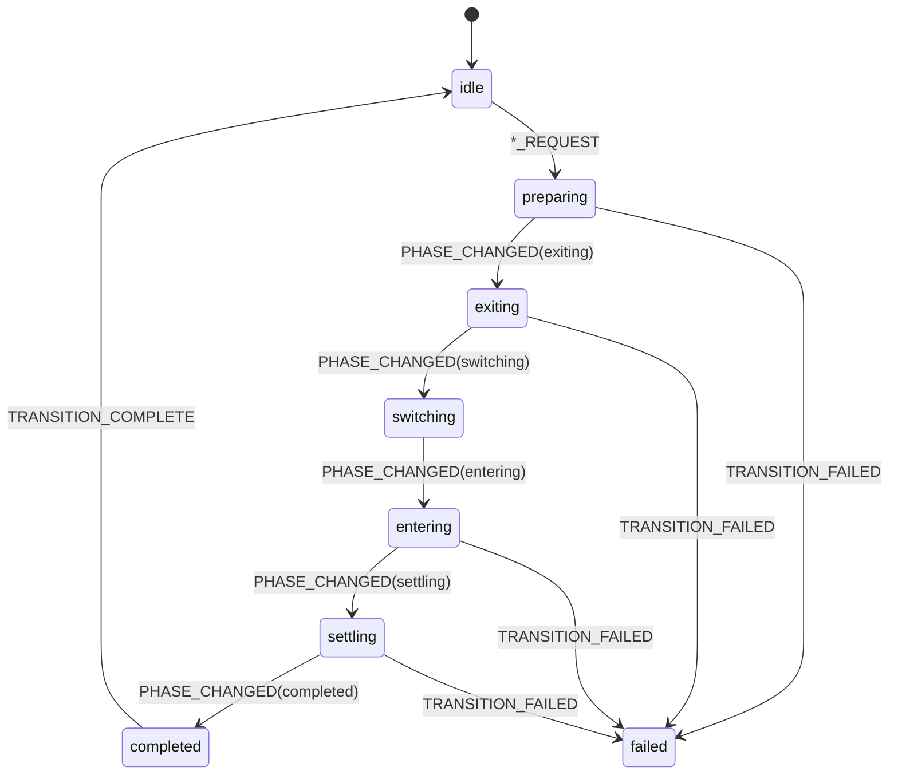

# Transition Engine V2

This branch is an experimental, educational architecture rewrite.

The goal is not animation parity with V1.
The goal is to demonstrate professional frontend architecture patterns for complex transition systems.

## Architecture Overview

### What The Transition Engine Is

The transition engine is the runtime core that coordinates transition lifecycle, state, events, queueing, and debugging.

It is implemented in:
- `transition/engine/transition-types.ts`
- `transition/engine/transition-events.ts`
- `transition/engine/transition-machine.ts`
- `transition/engine/transition-reducer.ts`
- `transition/engine/TransitionProvider.tsx`
- `transition/engine/useTransitionEngine.ts`
- `transition/engine/transition-selectors.ts`

### Why It Exists

Without an engine, transitions are usually spread across components as ad-hoc effects.
That creates hidden coupling and makes race conditions hard to reason about.

The engine makes transition behavior explicit, event-driven, and traceable.

### What Problem It Solves

It solves:
1. Fragmented orchestration
2. Implicit state transitions
3. Hard-to-debug animation timing issues
4. Tight coupling between business flow and GSAP details
5. Difficult extension when adding new transition types

## Folder Structure

```text
app/
  layout.tsx
  (pages)/
    layout.tsx
    [[...slug]]/page.tsx

components/
  about/
  contact/
  exhibitions/
  global/
  home/
  navigation/
    Navbar.tsx
    NavbarMenuPanel.tsx
  not-found/
  pages/
    PageHost.tsx
    PageStage.tsx
  projects/
  shell/
    AppShell.tsx
    IntroLoader.tsx
    MobileGate.tsx
    TransitionDebugPanel.tsx
  svg/

hooks/
  useMediaQuery.tsx

routing/
  route-manifest.ts

transition/
  adapters/
    dom-targets.ts
    gsap-adapter.ts
    route-adapter.ts
  docs/
    architecture-notes.md
  engine/
    TransitionContext.ts
    TransitionProvider.tsx
    transition-debug-log.ts
    transition-events.ts
    transition-machine.ts
    transition-reducer.ts
    transition-selectors.ts
    transition-types.ts
    useTransitionEngine.ts
  orchestrators/
    LoaderOrchestrator.tsx
    MenuOrchestrator.tsx
    NavigationOrchestrator.tsx
  primitives/
    timeline-primitives.ts
  registry/
    register-default-transitions.ts
    transition-registry.ts

utils/
  cn.ts
  isActiveRoute.ts
```

### Why Each Folder Exists

1. `transition/engine`
- Owns domain state, events, reducer, machine rules, and public API.
- Never owns JSX rendering.

2. `transition/orchestrators`
- Converts engine requests into transition execution.
- Owns lifecycle progression events around transition runs.

3. `transition/registry`
- Maps transition type keys to executable recipes.
- Enables additive extensibility.

4. `transition/adapters`
- Isolates GSAP and DOM target discovery from business logic.

5. `transition/primitives`
- Reusable animation building blocks.
- Prevents copy/pasted timeline snippets.

6. `components/pages`
- Pure route-stage rendering surface.

7. `components/navigation`
- Navigation UI that emits intent events.

8. `components/shell`
- Runtime composition root: orchestrators + UI surfaces + boot flow + debug panel.

9. `routing`
- Central route manifest and route-to-component mapping.

## State Machine

### States

Engine phase states (`TransitionPhase`):
1. `idle`
2. `preparing`
3. `exiting`
4. `switching`
5. `entering`
6. `settling`
7. `completed`
8. `failed`

### Events

Core events (`TransitionEvent`):
1. `NAVIGATE_REQUEST`
2. `MENU_OPEN_REQUEST`
3. `MENU_CLOSE_REQUEST`
4. `LOADER_COMPLETE_REQUEST`
5. `SET_MOBILE_VIEWPORT`
6. `PHASE_CHANGED`
7. `SET_MENU_STATE`
8. `TRANSITION_COMPLETE`
9. `TRANSITION_FAILED`

### Machine Guardrails

`transition-machine.ts` prevents invalid combinations such as:
- Opening menu while another transition is active
- Completing transition when no request exists
- Loader completion when loader is already hidden

### Lifecycle Diagram



## Reducer

### Why Reducers Are Used

Reducers provide:
1. deterministic state transitions
2. centralized event handling
3. explicit transition logs
4. easy debugging and replay mental model

### Event Flow Through Reducer

Reducer is implemented in `transition-reducer.ts`.
It handles all transition events and updates:
- phase
- route state (`activePath`, `pendingPath`, `queuedPath`)
- menu state
- viewport lock state
- loader visibility
- debug log entries
- error state

### Queueing Behavior

If `NAVIGATE_REQUEST` arrives while phase is not `idle`, it becomes `queuedPath`.
On `TRANSITION_COMPLETE`, queued navigation auto-starts.

## Transition Registry

### What Registry Means Here

A transition registry is a typed map from transition key to executable recipe.

Implemented in:
- `transition-registry.ts`
- `register-default-transitions.ts`

### Why It Exists

Without a registry, every new transition adds conditional branches in orchestrators.
With registry, new transitions are additive modules.

### How New Types Are Added

1. Add a new key to `TransitionTypeKey` in `transition-types.ts`.
2. Register recipe in `register-default-transitions.ts` or new registration module.
3. Emit request event that references the new type.

### Example

```ts
registerTransition({
  key: "menu-open",
  description: "Reveal full-screen menu panel",
  run: async () => {
    // timeline steps
  },
});
```

## Orchestration Layer

### What Orchestration Means

Orchestration means coordinating lifecycle phases and invoking transition recipes.

### Why It Is Separate From Rendering

Rendering components should focus on visual state.
Orchestrators focus on process and timing.

Files:
- `NavigationOrchestrator.tsx`
- `MenuOrchestrator.tsx`
- `LoaderOrchestrator.tsx`

Each orchestrator:
1. watches engine state
2. filters by request kind
3. dispatches lifecycle phase events
4. executes registry recipe
5. dispatches complete/failure events

## Adapters

### Why Adapters Exist

Adapters isolate external/runtime details from domain logic.

### Problems They Solve

1. DOM selector coupling (`dom-targets.ts`)
2. animation runtime abstraction (`gsap-adapter.ts`)
3. pathname normalization and navigation checks (`route-adapter.ts`)

### Why GSAP Is Decoupled

Business state should not know GSAP API details.
If animation engine changes later, adapter boundaries reduce rewrite scope.

## Event Flow

## 1. Normal Page Navigation

1. User clicks `Link`.
2. Next updates `pathname`.
3. `components/shell/AppShell.tsx` compares pathname against engine route state.
4. `NAVIGATE_REQUEST` dispatched.
5. Reducer enters `preparing`, stores `pendingPath`, locks viewport.
6. `NavigationOrchestrator` dispatches phase progression and runs `page-default` recipe.
7. Recipe gets targets from `dom-targets.ts` and runs timeline primitives.
8. On success orchestrator dispatches `TRANSITION_COMPLETE`.
9. Reducer returns to `idle` and unlocks viewport.

## 2. Menu Open

1. User clicks menu toggle in `components/navigation/Navbar.tsx`.
2. `MENU_OPEN_REQUEST` dispatched.
3. Reducer sets `menuState=opening`, phase `preparing`.
4. `MenuOrchestrator` runs `menu-open` recipe.
5. On complete reducer sets `menuState=open`, phase `idle`.

## 3. Menu Close

1. Toggle click dispatches `MENU_CLOSE_REQUEST`.
2. Reducer sets `menuState=closing`.
3. `MenuOrchestrator` runs `menu-close` recipe.
4. On complete reducer sets `menuState=closed`, phase `idle`.

## 4. Loader Completion

1. `IntroLoader` runs intro text animation.
2. Loader emits `LOADER_COMPLETE_REQUEST`.
3. Reducer enters `preparing`, request kind `loader-complete`.
4. `LoaderOrchestrator` runs `loader-to-page` recipe.
5. On completion reducer hides loader and returns to `idle`.

## 5. Queued Navigation

1. While transition is running, another `NAVIGATE_REQUEST` arrives.
2. Reducer stores it as `queuedPath`.
3. Active transition completes and dispatches `TRANSITION_COMPLETE`.
4. Reducer auto-starts queued navigation as new request.
5. Queue is cleared and lifecycle repeats.

## Comparison with V1

## How V2 Differs From V1

### Responsibilities Moved

1. Transition state and queueing moved out of layout-specific logic into reducer + machine.
2. GSAP transition definitions moved from component effects into registry recipes.
3. DOM querying moved into adapters.
4. Flow control moved from UI components into orchestrators.

### Problems Solved

1. Implicit lifecycle became explicit and inspectable.
2. New transition types can be added without editing core orchestrator logic.
3. Debugging now has a first-class event log panel.
4. Rendering and orchestration are cleanly separated.

### Tradeoffs Introduced

1. More files and more concepts to learn.
2. Additional ceremony for simple transitions.
3. Requires discipline to keep boundaries clean.

### Complexity Added

1. Event taxonomy
2. Reducer + machine layers
3. Orchestrator coordination
4. Registry and adapter abstractions

### When V1 Is Preferable

V1 may be preferable for:
1. very small projects
2. one-off portfolio interactions
3. teams that do not need extensibility or event traceability
4. short-lived demos with minimal future changes

## Debugging Guide

### Where Transition State Lives

In `TransitionProvider` reducer state.
Inspect through `TransitionDebugPanel`.

### How To Inspect Transitions

1. Open in-app “Transition Debug” panel.
2. Observe phase, active/pending/queued paths, menu state, viewport mode.
3. Read latest log entries with event name and message.

### How To Trace Event Flow

1. Trigger user action.
2. Confirm request event in logs.
3. Confirm phase progression events.
4. Confirm `TRANSITION_COMPLETE` closes lifecycle.

### Diagnose Common Failures

1. Missing DOM target: check `data-transition-role` attributes.
2. Unknown transition type: check registry registration.
3. Stuck in non-idle phase: inspect orchestrator errors and `lastError`.

## Extending The System

## Add A New Page Transition

1. Add key in `TransitionTypeKey`.
2. Register recipe in registry.
3. Dispatch request with that transition type.

## Add A Modal Transition

1. Create modal request events and modal state in reducer.
2. Add `modal-open` / `modal-close` transition keys.
3. Add `ModalOrchestrator`.
4. Add modal DOM targets in adapter.

## Add A Shared Element Transition

1. Extend DOM adapter to resolve source and target shared nodes.
2. Create primitive helpers for measuring/animating bounds.
3. Register `shared-element-page` recipe.
4. Trigger request based on route metadata.

## Add A Completely New Transition Type

Pattern:
1. event + reducer state impact
2. transition key
3. registry recipe
4. orchestrator route
5. render target contract
6. debug logging message

## Running The Project

```bash
npm install
npm run dev
```

Open http://localhost:3000.

## Notes For Learners

Start reading in this order:
1. `transition/engine/transition-types.ts`
2. `transition/engine/transition-events.ts`
3. `transition/engine/transition-reducer.ts`
4. `transition/orchestrators/*`
5. `transition/registry/*`
6. `components/shell/AppShell.tsx`
7. `components/pages/PageHost.tsx`
8. `transition/adapters/*`
